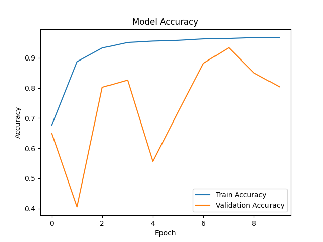

# 🩸 Blood Cell Classification using Transfer Learning

## 📌 Overview

This project uses **Deep Learning and Transfer Learning (MobileNetV2)** to classify blood cell images into four categories:

* Eosinophil
* Lymphocyte
* Monocyte
* Neutrophil

A **Flask web application** is built to allow users to upload images and get predictions in real time.

---

## 🧠 Model Details

* Base Model: MobileNetV2 (Pretrained on ImageNet)
* Technique: Transfer Learning + Fine Tuning
* Input Size: 224x224
* Output: 4-class classification

---

## 📊 Dataset

* Source: Kaggle Blood Cell Dataset
* Preprocessed and split into training and validation sets

---

## 🚀 Features

* Image Upload via Web UI
* Real-time Prediction
* Confidence Score Display
* Class Probability Visualization
* Accuracy Graph using Matplotlib
* Clean and Premium UI

---

## 📸 Screenshots

### Upload Page


### Prediction Result


---

## 📊 Model Performance



---

## ⚙️ Installation

```bash
pip install -r requirements.txt
```

---

## ▶️ Run Application

```bash
python app.py
```

Then open:

```
http://127.0.0.1:5000/
```

---

## 🧪 Training the Model

```bash
python src/train.py
```

---

## 📁 Project Structure

```
src/           → Model training & prediction logic  
templates/     → HTML UI  
static/        → Images, graphs  
```

---

## ❌ Ignored Files

Dataset and model files are excluded using `.gitignore`.

---

## 🎯 Future Improvements

* Deploy on cloud (Render / Railway)
* Add real-time camera detection
* Improve accuracy with larger dataset

---

## 👨‍💻 Author

Nishkarsh Singh
